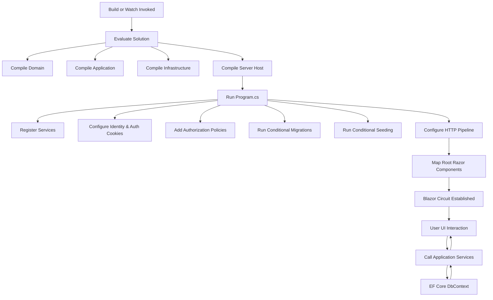

# EastSeat.ResourceIdea Blazor Server – Build & Run Guide

> This document explains how the Blazor Server application (`EastSeat.ResourceIdea.Server`) is built, configured, and executed locally. It complements `ONBOARDING.md` by drilling into the runtime composition (DI, Identity, EF Core, policies) and operational flags.

## 1. Prerequisites

- .NET 10 SDK installed (verify with `dotnet --version`).
   - Rationale: All projects target `net10.0` (see `Directory.Build.props` and `EastSeat.ResourceIdea.Server.csproj`). Using an earlier SDK will cause restore/build failures.
- PostgreSQL instance reachable (local container via `docker-compose up -d` or external server).
- A valid connection string named `DefaultConnection` in `appsettings.Development.json` or user secrets / environment.
- (Optional) Node/npm NOT required – Blazor Server renders on the server.

## 2. Solution & Project Layout (High-Level)

```text
EastSeat.ResourceIdea.slnx
├── src/
│   ├── EastSeat.ResourceIdea.Domain/        (Entities, Value Objects, Guards, CalendarService)
│   ├── EastSeat.ResourceIdea.Application/   (Application services: Client, Engagement, Planner, Rollover)
│   ├── EastSeat.ResourceIdea.Infrastructure/(EF Core DbContext, Identity types, Migrations, DataSeeder)
│   └── EastSeat.ResourceIdea.Server/        (Blazor Server host, Program.cs, Components, DI wiring)
└── tests/                                   (xUnit test projects: Domain, Application, Integration)
```

## 3. Build Commands

Typical build (invoked by VS Code task):

```bash
dotnet build EastSeat.ResourceIdea.slnx
```

Continuous development (hot reload / watch):

```bash
dotnet watch run --project src/EastSeat.ResourceIdea.Server/EastSeat.ResourceIdea.Server.csproj
```

If you only need to validate infrastructure layer compile:

```bash
dotnet build src/EastSeat.ResourceIdea.Infrastructure/EastSeat.ResourceIdea.Infrastructure.csproj
```

## 4. Runtime Composition (Program.cs Overview)

Order of operations inside `Program.cs`:

1. Create `WebApplicationBuilder`.
2. Register Razor Components (`AddRazorComponents().AddInteractiveServerComponents()`).
3. Add MudBlazor (`AddMudServices()`).
4. Acquire `DefaultConnection` and configure `DbContext` with `UseNpgsql`.
5. Configure ASP.NET Identity:
   - Password policy (min length 8, requires digit, lowercase, uppercase, non-alphanumeric).
   - Lockout (15 minutes, 5 attempts).
   - Unique email enforcement.
   - Stores are EF Core backed via `ApplicationDbContext`.
6. Cookie authentication settings (HTTP-only, 8h expiration, sliding, paths for login & access denied).
7. Register cross-cutting services:
   - `IApplicationDbContext` abstraction mapped to `ApplicationDbContext`.
   - `ICurrentUserService` (wraps `IHttpContextAccessor`).
   - Domain/Application services: `ClientService`, `EngagementService`, `PlannerService`, `RolloverService`.
   - `DataSeeder` for initial admin + roles.
8. Define authorization policies:
   - `AdminOnly` (Admin role).
   - `ManageEngagements` (Admin, Partner, Manager roles).
   - `ViewPlanner` (any authenticated user).
9. Conditional data seeding if `SEED_ADMIN_USER=true`.
10. Conditional migrations if `RunMigrationsOnStartup=true` and environment is Development.
11. Configure HTTP pipeline (ExceptionHandler/HSTS for non-dev, HTTPS redirection, static files, antiforgery, authentication, authorization).
12. Map Razor root component `App` and run.

## 5. Environment & Configuration Flags

| Flag | Source | Purpose |
|------|--------|---------|
| `DefaultConnection` | `appsettings.*.json` / secrets / env | PostgreSQL connection string used by EF Core. |
| `SEED_ADMIN_USER` | env/appsettings bool | When true, seeds initial Admin user + roles at startup (skips gracefully if DB unreachable). |
| `RunMigrationsOnStartup` | env/appsettings bool | When true (and Development), applies pending EF Core migrations automatically. |

### Recommended Local `.env.sample` Values (Do NOT commit real secrets)

```text
SEED_ADMIN_USER=true
RunMigrationsOnStartup=true
```

Then configure the connection string in `appsettings.Development.json` or user secrets.

## 6. Database & Migrations

Migrations live under `src/EastSeat.ResourceIdea.Infrastructure/Migrations/`. Create new migrations via helper script or manually:

```bash
dotnet ef migrations add AddEngagementYearTable --project src/EastSeat.ResourceIdea.Infrastructure --startup-project src/EastSeat.ResourceIdea.Server
```

Apply manually (if not using the startup flag):

```bash
dotnet ef database update --project src/EastSeat.ResourceIdea.Infrastructure --startup-project src/EastSeat.ResourceIdea.Server
```

## 7. Identity & Authorization Flow

- Authentication uses cookie scheme set by Identity.
- Policies restrict sensitive operations (engagement management) while planner read access only requires authentication.
- Extend `ApplicationUser` / `ApplicationRole` in Infrastructure when new profile fields or roles are needed.

## 8. Data Seeding Behavior

On startup with `SEED_ADMIN_USER=true`:

- Checks DB connectivity via `Database.CanConnectAsync()`.
- Invokes `DataSeeder.SeedAsync()`; logs errors without failing app startup to preserve developer velocity.

## 9. Hot Reload & Developer Experience

`dotnet watch run` enables:

- Component & C# code changes auto-recompiled and reloaded.
- Reduced iteration time for UI tweaks and service logic.

If watch becomes unstable (rare), fall back to standard run:

```bash
dotnet run --project src/EastSeat.ResourceIdea.Server/EastSeat.ResourceIdea.Server.csproj
```

## 10. Mermaid Diagram – Build & Run Composition



## 11. Troubleshooting Quick Tips

| Symptom | Suggestion |
|---------|------------|
| Connection string exception | Verify `DefaultConnection` exists & PostgreSQL is running. |
| Migrations not applied | Set `RunMigrationsOnStartup=true` or run manual `dotnet ef database update`. |
| Admin user missing | Ensure `SEED_ADMIN_USER=true` and check logs for seeding errors. |
| Authorization denied | Confirm signed-in user has required role; seed roles first. |
| Hot reload stuck | Stop watch, clear bin/obj (`dotnet clean`), restart watch. |

## 12. Minimal Daily Workflow

1. Start PostgreSQL (local or container).
2. Export environment flags if desired.
3. `dotnet watch run --project src/EastSeat.ResourceIdea.Server/EastSeat.ResourceIdea.Server.csproj`
4. Develop components/services; verify UI updates live.
5. Run tests periodically:

```bash
dotnet test EastSeat.ResourceIdea.slnx --filter TestCategory!=Slow
```

## 13. Next Enhancements (Future Considerations)

- Add caching layer for planner queries.
- Introduce testcontainers for integration tests.
- Potential Serilog + structured logging.
- bUnit tests for complex component rendering & planner virtualization.

---
**Reminder:** Keep changes minimal, respect domain invariants, and avoid introducing disallowed dependencies.
